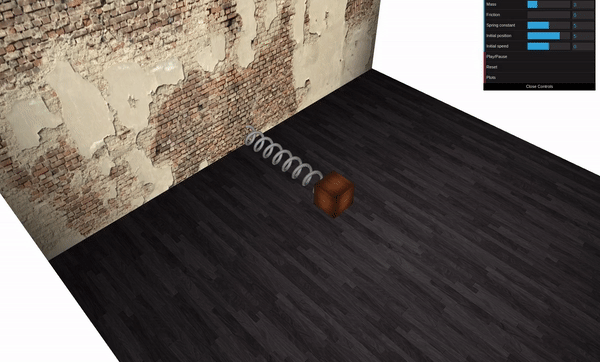
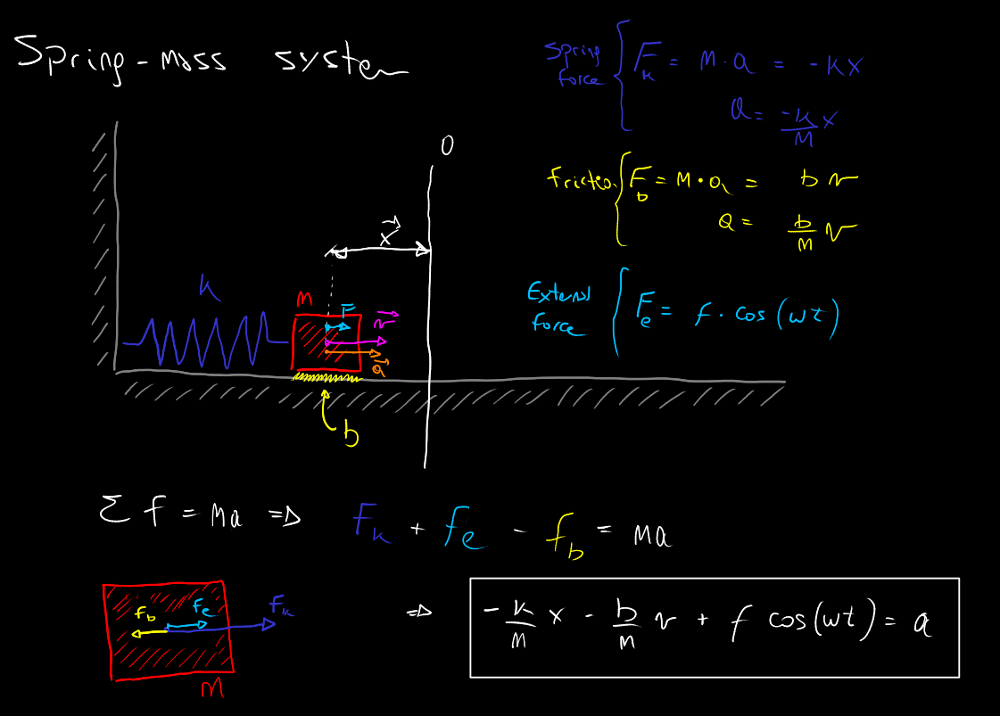

# Javascript 3D Mechanics Experiments

This is a small compendium of javascript 3D animations that allows the user to perform mechanics experiments with bodies and systems. 

<p align="center">
  
</p>

In the [/doc](doc) folder you can find the mathematical model for each system.

<p align="center">
  
</p>

This equations are solved using simple numerical methods as Euler or RK4 integrators. For each simulation, there is a ```dynamic()``` class that contains the mechanical model.

```js
// Spring-mass system model - iteration step
this.step = function(){    
    // Forces acting on the body
    var spring_force = -this.k * this.x; 
    var friction_force = -this.b this.v;
    var external_force = this.F * Math.cos(this.w * this.t); 
    // Update acceleration
    this.a = (spring_force + friction_force + external_force) / this.m;
    // Update velocity
    this.v += this.a * this.dt; 
    // Update position
    this.x += this.v * this.dt; 
    // Update time
    this.t += this.dt; 
}
```

The experiment library is available online on [this site](https://physics-experiments.herokuapp.com).

This is a small part of a bigger project that was developed in the context of an internship carried out in the Department of Electrical Engineering and Computers, at National University of the South.
